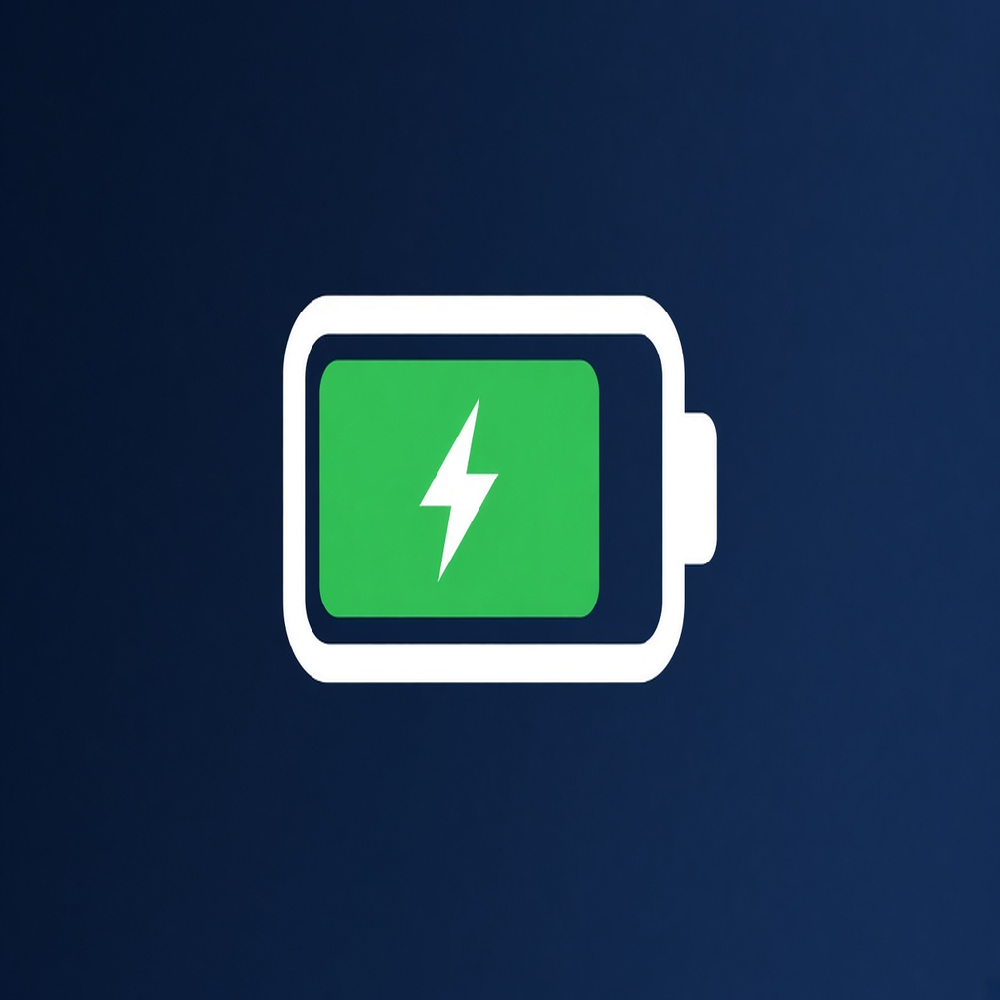
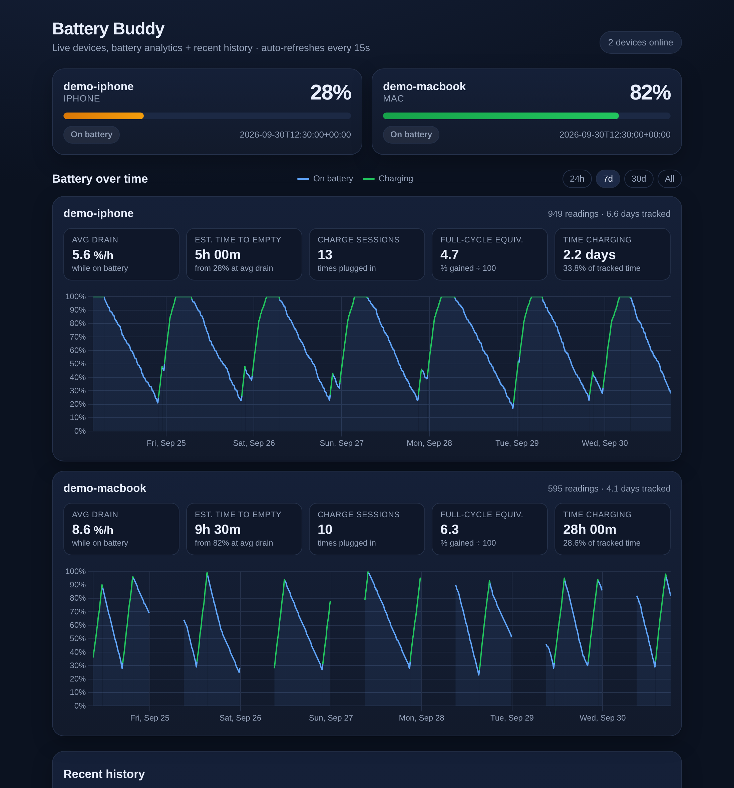
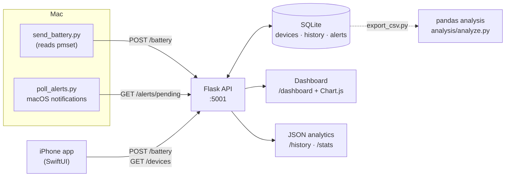
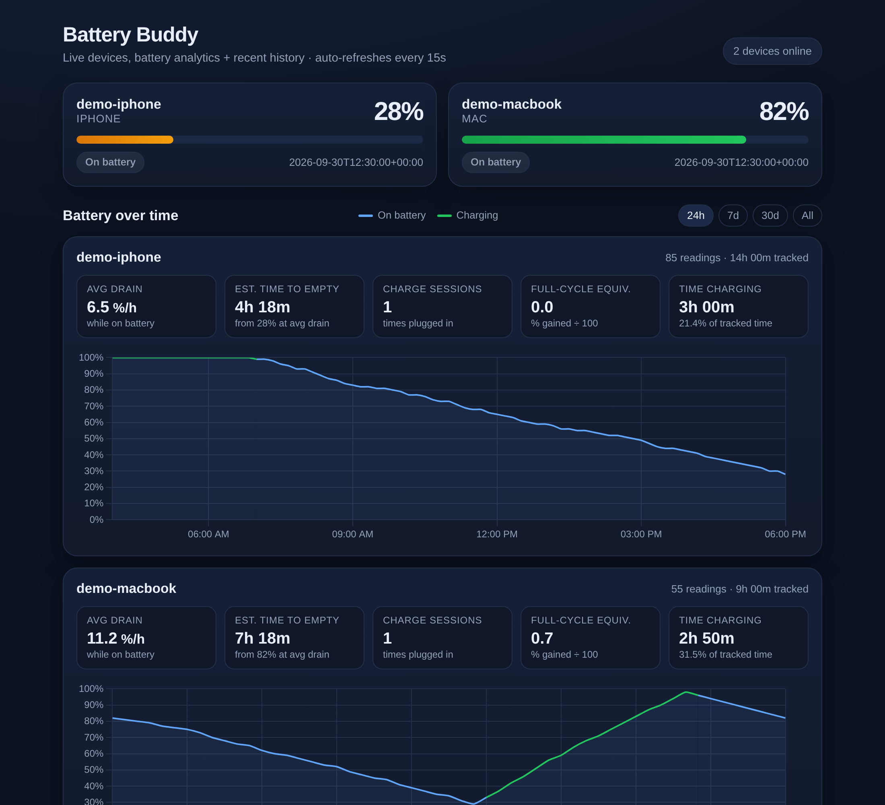
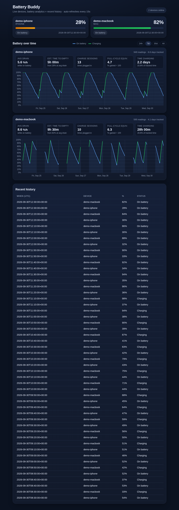

<p align="center">
  
</p>

<h1 align="center">Battery Buddy</h1>

<p align="center">
  A self-hosted battery tracker for my Mac and iPhone: a Flask + SQLite API collects readings,
  and a dashboard turns them into charts and battery analytics.
</p>

<p align="center">
  <a href="https://github.com/Neelp1073/battery-buddy/actions/workflows/ci.yml"></a>
  
  
</p>



<sub>The screenshot uses <b>simulated sample data</b> (devices <code>demo-iphone</code> and <code>demo-macbook</code>) from a seeded simulator. It shows how the dashboard looks and is not a real usage log.</sub>

---

## Features

- **Collect readings from two platforms.** A Python script reads the Mac battery with `pmset`, and a SwiftUI app sends the iPhone's level. Both post to the same REST API.
- **Store every reading.** Each `POST /battery` updates the device's latest state *and* appends a row to a `history` table in SQLite.
- **Live dashboard** at `/dashboard`: device cards, a battery % over time chart per device (charging periods in green), a 24h / 7d / 30d / All range picker, and the latest 50 readings.
- **Battery analytics:** average drain rate on battery, estimated time to empty, charge sessions, full-cycle equivalents and time spent charging. They're available as JSON (`/stats`) and on the dashboard.
- **Alerts.** A low-battery alert is queued when a device drops to 20% or below while unplugged, plus an optional hourly status alert. `mac/poll_alerts.py` shows them as macOS notifications.
- **Offline analysis with pandas** (`analysis/`): export readings to CSV and recompute the same stats, plus drain by hour of day and a daily summary.
- **Tested.** A pytest suite covers every endpoint, the stats functions, the Mac scripts' parsing, and a check that the pandas numbers match the API's. It runs on GitHub Actions on every push.

## Architecture



**Data model** (SQLite, created automatically on first run):

| Table | Purpose | Key columns |
|---|---|---|
| `devices` | Latest state per device (upserted) | `device_id` (PK), `device_type`, `battery_percent`, `is_charging`, `updated_at` |
| `history` | Every reading ever received (the time series) | `device_id`, `battery_percent`, `is_charging`, `created_at` (indexed with `device_id`) |
| `alerts` | Queued low-battery / hourly alerts | `device_id`, `kind`, `message`, `created_at`, `delivered` |

## Tech stack

| Area | Tools |
|---|---|
| Backend | Python, Flask, SQLite (`sqlite3`), Jinja2 |
| Dashboard | HTML/CSS, [Chart.js](https://www.chartjs.org/) (CDN) |
| Data analysis | pandas |
| Clients | Python (`pmset`, `osascript`) on macOS; Swift / SwiftUI on iOS |
| Quality | pytest, GitHub Actions |

## Quick start

### 1. Backend

```bash
git clone https://github.com/Neelp1073/battery-buddy.git
cd battery-buddy
python3 -m venv .venv && source .venv/bin/activate
pip install -r requirements.txt

python backend/app.py
```

- API: <http://127.0.0.1:5001/>
- Dashboard: <http://127.0.0.1:5001/dashboard>

The server listens on `0.0.0.0:5001` so an iPhone on the same Wi-Fi can reach it. To change settings, copy `.env.example` to `.env`, edit it, and load it with `set -a; source .env; set +a`:

| Variable | Default | Meaning |
|---|---|---|
| `BB_HOST` | `0.0.0.0` | Interface to bind |
| `BB_PORT` | `5001` | Port |
| `BB_DB_PATH` | `backend/battery.db` | SQLite file |
| `BB_DEBUG` | `0` | Flask debug mode (keep off on a shared network) |
| `BB_LOW_BATTERY_THRESHOLD` | `20` | Low-battery alert threshold (%) |
| `BB_HOURLY_SECONDS` | `3600` | Interval of the hourly status alert |

#### Try it with sample data

```bash
python analysis/simulate_readings.py --db backend/sample.db   # 7 days of SIMULATED readings
BB_DB_PATH=backend/sample.db python backend/app.py
```

The simulator only writes `demo-*` devices and uses a separate database file, so it never touches your real `battery.db`.

### 2. Mac sender (macOS)

```bash
cd mac
export BACKEND_URL=http://127.0.0.1:5001   # default; use the Mac's IP if the backend runs elsewhere
export DEVICE_ID=neels-macbook              # default
python3 send_battery.py                     # send one reading
python3 check_and_notify.py                 # show this Mac's latest level as a notification
python3 poll_alerts.py                      # optional: turn queued alerts into notifications
```

`send_battery.py` sends a single reading each time it runs. To build up a history automatically, schedule it, for example with `crontab -e`:

```cron
*/10 * * * * BACKEND_URL=http://127.0.0.1:5001 /usr/bin/python3 /path/to/battery-buddy/mac/send_battery.py >/dev/null 2>&1
```

### 3. iPhone app (Xcode)

1. In Xcode, create a new iOS **App** project named `Batterybuddy` (SwiftUI interface).
2. Replace the generated `ContentView.swift` and `BatterybuddyApp.swift` with the files in [`ios/`](ios/). You can use `docs/battery-buddy-icon-1024.png` as the app icon.
3. In `ContentView.swift`, set `AppConfig.baseURL` to your Mac's Wi-Fi address, for example `http://192.168.1.20:5001`. Run `ipconfig getifaddr en0` on the Mac to find it.
4. The backend uses plain HTTP on your local network, so add **App Transport Security Settings → Allow Arbitrary Loads = YES** to the target's Info settings. This is for local development only.
5. Run the app on a **real iPhone** (the Simulator has no battery) and allow local network access when asked. Tap **Send iPhone battery** to post a reading.

## API reference

| Method | Path | Description | Used by |
|---|---|---|---|
| `GET` | `/` | Health check: `{"ok": true, "message": "..."}` | — |
| `POST` | `/battery` | Store a reading. JSON body: `device_id`, `device_type` (`mac` or `iphone`), `battery_percent` (0–100), `is_charging`, optional `push_token`. Returns `{"ok": true, "stored": {...}}`, or `400` with an error message | Mac sender, iOS app |
| `GET` | `/devices` | Latest state of every device | iOS app, `check_and_notify.py` |
| `GET` | `/alerts/pending?device_id=` | Undelivered alerts (optionally for one device) | `poll_alerts.py` |
| `POST` | `/alerts/<id>/delivered` | Mark an alert as delivered | `poll_alerts.py` |
| `GET` | `/history?device_id=&hours=` | Readings, oldest first. `hours` defaults to `168` (7 days); `0` returns everything | Analysis, integrations |
| `GET` | `/stats?device_id=&hours=` | Per-device analytics over the same window | Dashboard, integrations |
| `GET` | `/dashboard?hours=` | HTML dashboard | Browser |

Example:

```bash
curl -X POST http://127.0.0.1:5001/battery \
  -H "Content-Type: application/json" \
  -d '{"device_id": "neels-macbook", "device_type": "mac", "battery_percent": 76, "is_charging": false}'

curl "http://127.0.0.1:5001/stats?device_id=neels-macbook&hours=24"
```

<details>
<summary>Example <code>/stats</code> response (simulated sample data)</summary>

```json
{
  "ok": true,
  "hours": 168,
  "stats": [
    {
      "device_id": "demo-macbook",
      "readings": 595,
      "first_reading": "2026-09-24T03:30:00+00:00",
      "last_reading": "2026-09-30T12:30:00+00:00",
      "current_percent": 82,
      "is_charging": false,
      "avg_drain_per_hour": 8.64,
      "charge_sessions": 10,
      "equivalent_full_cycles": 6.35,
      "hours_charging": 28.0,
      "hours_tracked": 98.0,
      "pct_time_charging": 28.6,
      "est_hours_to_empty": 9.5
    }
  ]
}
```
</details>

## Analytics

Readings are samples taken at irregular times, so every metric works on **intervals between consecutive readings of the same device**. Two rules keep the numbers honest:

1. An interval belongs to the state of its **earlier** reading. For example, time after a reading that says "charging" counts as charging time.
2. Intervals longer than **1 hour** are skipped. A long gap usually means the Mac was asleep or nothing was sending, so we don't know what happened in between.

| Metric | How it's calculated | Why it's useful |
|---|---|---|
| **Average drain rate (%/h)** | Total % lost ÷ total hours, using only intervals where both readings are on battery | Compares devices and shows how heavy the usage is |
| **Estimated time to empty** | Current % ÷ average drain rate (only when unplugged) | A simple "how long will this last" forecast |
| **Charge sessions** | Number of *unplugged → charging* transitions | How often the device gets plugged in |
| **Full-cycle equivalent** | % gained while charging ÷ 100. Two 50% top-ups = 1 cycle, which is how Apple counts battery cycles | A rough measure of battery wear |
| **Time charging** | Hours in intervals that start while charging, also shown as a % of tracked time | Shows how long devices sit on the charger, including at 100% |

The logic lives in [`backend/stats.py`](backend/stats.py) as small, pure functions. [`analysis/analyze.py`](analysis/analyze.py) reimplements it with vectorised pandas (`groupby`, `shift`, `diff`), and a test checks that both give the same results.

### Offline analysis

```bash
python analysis/export_csv.py --db backend/battery.db --out analysis/output/readings.csv
python analysis/analyze.py --csv analysis/output/readings.csv --out analysis/output
python analysis/analyze.py      # no arguments: runs on the bundled simulated sample
```

Output on the bundled **simulated** sample (`analysis/sample_data/simulated_readings.csv`, 7 days, seed 42):

| Metric | demo-iphone | demo-macbook |
|---|---|---|
| Readings | 1,008 | 630 |
| Avg drain on battery | 5.56 %/h | 8.51 %/h |
| Charge sessions | 13 | 10 |
| Full-cycle equivalent | 5.17 | 6.35 |
| Time charging | 57.8 h (34.5% of tracked) | 28.0 h (27.0% of tracked) |
| Est. time to empty (at last reading) | 5.0 h from 28% | 9.6 h from 82% |

These numbers describe the simulator's rules, not real devices. The script also prints the average drain for each hour of the day (the simulated Mac drains fastest during weekday work hours) and a daily min/mean/max summary.

## Running tests

```bash
pip install -r requirements.txt
pytest -v
```

The suite covers:

- `tests/test_api.py`: every endpoint, including the exact JSON fields the iOS app decodes, validation errors, the low-battery alert flow, and `/history` time filters.
- `tests/test_stats.py`: each metric on small hand-built time series, including edge cases like gaps, unplugging at 100%, and empty data.
- `tests/test_analysis.py`: the pandas results match `/stats`, and the simulator is deterministic.
- `tests/test_mac.py`: `BACKEND_URL`/`DEVICE_ID` settings and parsing of real `pmset -g batt` output formats.

[GitHub Actions](.github/workflows/ci.yml) runs the tests on Python 3.10 and 3.12 on every push.

## Project structure

```
battery-buddy/
├── backend/
│   ├── app.py               # Flask API, SQLite access, dashboard route, alert worker
│   ├── config.py            # settings from environment variables
│   ├── stats.py             # battery analytics (pure functions)
│   ├── templates/
│   │   └── dashboard.html   # dashboard UI + Chart.js charts
│   └── requirements.txt     # minimal server-only dependencies
├── mac/
│   ├── send_battery.py      # read pmset and POST /battery
│   ├── poll_alerts.py       # poll alerts and show notifications
│   ├── check_and_notify.py  # one-off notification with this Mac's level
│   ├── show_notification.py # macOS notification helper (osascript)
│   └── settings.py          # BACKEND_URL / DEVICE_ID from the environment
├── ios/
│   ├── BatterybuddyApp.swift
│   └── ContentView.swift    # SwiftUI app; set AppConfig.baseURL
├── analysis/
│   ├── simulate_readings.py # seeded simulator (demo data only)
│   ├── export_csv.py        # SQLite -> CSV
│   ├── analyze.py           # pandas stats, drain by hour, daily summary
│   └── sample_data/simulated_readings.csv
├── tests/                   # pytest suite
├── docs/
│   ├── screenshots/         # dashboard screenshots (simulated data)
│   └── take_screenshots.sh  # regenerate screenshots with headless Chrome
├── .github/workflows/ci.yml
├── .env.example
├── requirements.txt
└── LICENSE
```

## More screenshots

| Last 24 hours | Full dashboard |
|---|---|
|  |  |

## What I learned

- **Designing one API for two very different clients.** The Python script and the Swift app send the same JSON, so I kept the API contract small and wrote tests around the exact fields the iOS `Codable` model expects.
- **Time-series data is messy.** Readings arrive at uneven intervals with gaps. I had to decide which state an interval belongs to (the earlier reading's) and when to ignore one (gaps over an hour). Those choices change the results as much as the formulas do.
- **Checking an analysis two ways.** I wrote the same metrics as plain Python and as pandas and added a test that they agree, so a change to one can't quietly change the numbers.
- **Platform details.** `pmset` reports a full, plugged-in Mac as `charged`, not `charging`. `UIDevice.batteryLevel` returns `-1` on the Simulator. Plain-HTTP calls from iOS need an App Transport Security exception.
- **Configuration and repo hygiene.** I moved from a hardcoded LAN IP and paths to environment variables, `.env.example`, `.gitignore` and CI.

## Limitations and future ideas

- The iPhone app only sends a reading when you tap the button. Background updates (e.g. `BGAppRefreshTask`) would give a much denser iPhone history.
- A plugged-in Mac at 100% reports `charged`, which `send_battery.py` records as not charging. The drain-rate maths treats it as 0% drain, which slightly lowers the average. Detecting "AC Power" would fix this.
- There's no authentication. It's meant for a trusted home network only. A shared API token would be the first step before exposing it anywhere else.
- `push_token` is stored but not used yet. Real iOS push notifications through APNs would replace polling.
- Longer-term analytics: track the drain rate week by week as a rough battery-health trend, and compare weekdays with weekends.
- Run the Mac sender as a `launchd` agent instead of cron, and package the backend with Docker.

## License

[MIT](LICENSE) © 2026 Neel Patel
